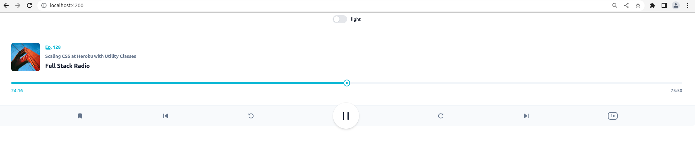

# Angular TailwindCSS Dark Theme Basic Example

This project is basic example of Angular Tailwind CSS Dark Theme.

## Run Dev 

Run `ng serve` for a dev server. Navigate to `http://localhost:4200/`. The app will automatically reload if you change any of the source files.

## Screenshots

